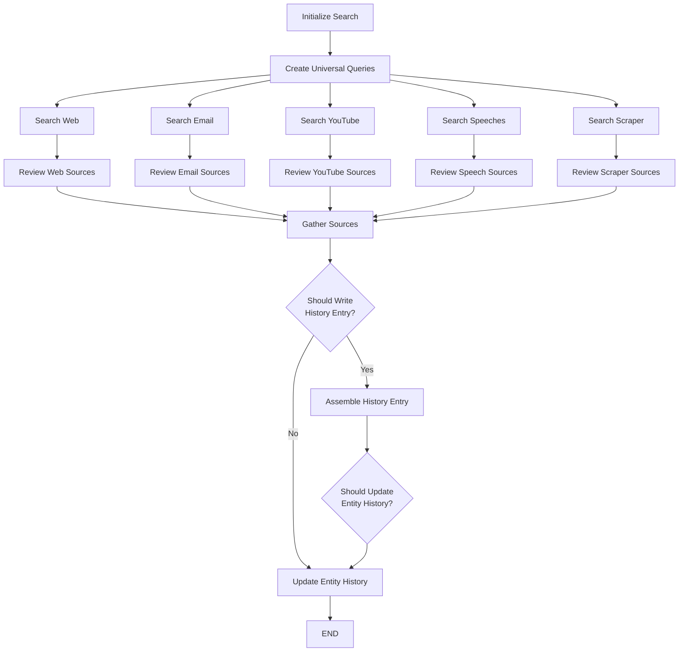

# Entity Tracker - LangGraph Entity Monitoring System

A sophisticated LangGraph-based system for automatically monitoring, tracking, and maintaining historical records of entities (people, organizations, locations, concepts) by gathering information from multiple sources and creating curated timelines.


## 🌟 Features

- **Multi-Source Research**: Automatically searches across web, email, YouTube, speeches, and scraper databases
- **Intelligent Query Generation**: Creates complementary search queries to maximize coverage
- **Source Review & Filtering**: LLM-driven evaluation to identify relevant, factual developments
- **Timeline Curation**: Builds precise, chronological entity histories with proper source attribution
- **Relationship Management**: Tracks entities in the context of their relationships with other entities
- **Factual Accuracy**: Sophisticated prompts ensure only actual events (not predictions) are tracked

## 📋 Table of Contents

- [Installation](#installation)
- [Quick Start](#quick-start)
- [Configuration](#configuration)
- [Usage Examples](#usage-examples)
- [Architecture](#architecture)
- [Deployment](#deployment)
- [Development](#development)
- [Contributing](#contributing)

## 🚀 Installation

### Prerequisites

- Python 3.11+
- OpenAI API key (or other supported LLM provider)
- Optional: Tavily API key for web search

### Setup

1. **Clone the repository**:
```bash
git clone https://github.com/yourusername/entity-tracker-langgraph.git
cd entity-tracker-langgraph
```

2. **Create a virtual environment**:
```bash
python -m venv venv
source venv/bin/activate  # On Windows: venv\Scripts\activate
```

3. **Install dependencies**:
```bash
pip install -r requirements.txt
```

4. **Configure environment variables**:
```bash
cp .env.example .env
# Edit .env and add your API keys
```

### Verify Installation

```bash
python -m pytest tests/
```

## ⚡ Quick Start

### Basic Usage

```python
import asyncio
from entity_tracker import graph

async def track_entity():
    result = await graph.ainvoke({
        "entity_name": "Federal Reserve",
        "entity_type": "organization",
        "current_date": "2024-01-15"
    })
    
    print(result["entity_history_output"])

# Run the tracker
asyncio.run(track_entity())
```

### With Relationship Context

```python
result = await graph.ainvoke({
    "entity_name": "inflation",
    "entity_type": "concept",
    "related_entity_name": "United States",
    "related_entity_type": "location",
    "relationship_type": "affects",
    "current_date": "2024-01-15"
})
```

### With Configuration Override

```python
from entity_tracker.configuration import Configuration

config = Configuration(
    debug=True,
    search_web_enabled=True,
    search_email_enabled=False,
    last_hours=48,  # Look back 2 days
    llm_reviewer="openai/gpt-4o",
)

result = await graph.ainvoke(
    {"entity_name": "ECB", "entity_type": "organization"},
    config={"configurable": config.__dict__}
)
```

## ⚙️ Configuration

### Environment Variables

Key environment variables (see `.env.example` for all options):

```bash
# Required
OPENAI_API_KEY=your_key_here

# Optional - Web Search
TAVILY_API_KEY=your_tavily_key_here

# Optional - Tracing
LANGCHAIN_TRACING_V2=true
LANGCHAIN_API_KEY=your_langsmith_key_here
```

### Configuration Options

The agent supports extensive configuration through the `Configuration` class:

```python
from entity_tracker.configuration import Configuration

config = Configuration(
    # LLM Configuration
    llm_query_creator="openai/gpt-4o-mini",
    llm_reviewer="openai/gpt-4o",
    llm_writer="openai/gpt-4o",
    
    # Search Configuration
    search_web_enabled=True,
    search_web_max_results=5,
    search_web_last_days=1,
    
    search_email_enabled=False,
    search_youtube_enabled=False,
    search_speeches_enabled=False,
    search_scraper_enabled=False,
    
    # History Configuration
    last_hours=24,  # Recency window for new developments
    entity_history_entry_limit=100,
    entity_history_last_hours=720,  # 30 days
    
    # Quality Control
    source_content_max_length=8000,
    debug=False,
)
```

## 📖 Usage Examples

### Example 1: Track a Person

```python
result = await graph.ainvoke({
    "entity_name": "Jerome Powell",
    "entity_type": "person",
    "current_date": "2024-01-15"
})

# Access results
for entry in result["entity_history_output"].entries:
    print(f"Event: {entry.content}")
    print(f"Sources: {len(entry.sources)}")
```

### Example 2: Track with Custom Queries

```python
result = await graph.ainvoke({
    "entity_name": "Tesla",
    "entity_type": "organization",
    "current_date": "2024-01-15",
    "graph_settings": {
        "search_queries": [
            "Tesla earnings report",
            "Tesla production numbers",
            "Elon Musk Tesla"
        ]
    }
})
```

### Example 3: Streaming Results

```python
async for chunk in graph.astream({
    "entity_name": "Bitcoin",
    "entity_type": "concept",
    "current_date": "2024-01-15"
}):
    print(f"Node: {chunk}")
```

### Example 4: Run with LangGraph Studio

```bash
# Install LangGraph Studio
pip install langgraph-studio

# Start the studio
langgraph-studio start
```

Then open http://localhost:3000 and select the `entity_tracker` graph.

## 🏗️ Architecture

### Workflow Overview



### Core Components

- **`agent.py`**: Main LangGraph workflow (13+ nodes)
- **`state.py`**: State management and data flow
- **`schemas.py`**: Pydantic models for data validation
- **`configuration.py`**: Agent configuration
- **`prompts.py`**: Sophisticated prompt system
- **`utils/`**: Utility functions
- **`database/`**: Entity storage operations (in-memory by default)
- **`tools/`**: Search tool integrations

### Key Features

#### 1. Multi-Stage Source Filtering

The agent uses a sophisticated 3-stage filtering process:

1. **Development Significance Filter**: Separates actual events from predictions
2. **Temporal Validation**: Distinguishes source publication from event occurrence dates
3. **Semantic Deduplication**: Groups sources reporting the same development, keeps best one

#### 2. Prompt Engineering for Factual Accuracy

Sophisticated prompts ensure high-quality timeline entries:

- **Factual vs. Predictive Distinction**: Rigid separation between actual events and forecasts
- **Attribution Accuracy**: Clear differentiation between originating vs. commenting actions
- **Timeline Writing Standards**: Professional journalism standards (25-word max, active voice, no speculation)

#### 3. Parallel Processing

Searches run in parallel for efficiency:
- Web, email, YouTube, speeches, and scraper searches execute simultaneously
- Independent review processes for each source type
- Efficient handling of multiple sources and queries

## 🚀 Deployment

### LangGraph Cloud

Deploy to LangGraph Cloud for production use:

```bash
# Install LangGraph CLI
pip install langgraph-cli

# Deploy
langgraph deploy
```

### Docker Deployment

```dockerfile
FROM python:3.11-slim

WORKDIR /app

COPY requirements.txt .
RUN pip install --no-cache-dir -r requirements.txt

COPY . .

CMD ["python", "-m", "langgraph", "serve", "--port", "8000"]
```

Build and run:

```bash
docker build -t entity-tracker .
docker run -p 8000:8000 --env-file .env entity-tracker
```

### Environment-Specific Configuration

Use different configurations for development vs. production:

```python
import os

if os.getenv("ENVIRONMENT") == "production":
    config = Configuration(
        llm_reviewer="openai/gpt-4o",
        search_web_enabled=True,
        search_email_enabled=True,
        debug=False,
    )
else:
    config = Configuration(
        llm_reviewer="openai/gpt-4o-mini",
        search_web_enabled=True,
        search_email_enabled=False,
        debug=True,
    )
```

## 🛠️ Development

### Project Structure

```
entity-tracker-langgraph/
├── entity_tracker/              # Main package
│   ├── __init__.py
│   ├── agent.py                 # LangGraph workflow
│   ├── state.py                 # State definitions
│   ├── schemas.py               # Pydantic models
│   ├── configuration.py         # Configuration
│   ├── prompts.py               # Prompt templates
│   ├── utils/                   # Utility functions
│   │   ├── llm.py              # LLM utilities
│   │   └── sources.py          # Source processing
│   ├── database/                # Database operations
│   │   └── operations.py       # Entity storage
│   └── tools/                   # Search tools
│       ├── web_search.py       # Web search integration
│       └── mock_tools.py       # Mock implementations
├── tests/                       # Unit tests
├── examples/                    # Usage examples
├── images/                      # Documentation images
├── langgraph.json              # LangGraph configuration
├── requirements.txt            # Python dependencies
├── .env.example                # Environment template
├── .gitignore
└── README.md
```

### Running Tests

```bash
# Run all tests
pytest

# Run with coverage
pytest --cov=entity_tracker --cov-report=html

# Run specific test file
pytest tests/test_agent.py
```

### Adding New Search Sources

To add a new search source:

1. Create a search function in `tools/`:

```python
# tools/my_search.py
from typing import List
from langchain.schema import Document

def my_custom_search(query: str, **kwargs) -> List[Document]:
    # Your search implementation
    return results
```

2. Add search and review nodes to `agent.py`:

```python
async def search_my_source(state, config):
    # Implement search logic
    return {"my_sources": results}

async def review_my_sources(state, config):
    # Implement review logic
    return {"my_sources": filtered_results}
```

3. Add configuration options to `configuration.py`

4. Wire up the nodes in the graph

### Customizing Prompts

All prompts are in `prompts.py` and can be customized:

```python
from entity_tracker.configuration import Configuration

custom_prompt = """Your custom prompt template here with {entity} and {current_date}"""

config = Configuration(
    sources_review_system_instructions=custom_prompt
)
```

## 🤝 Contributing

Contributions are welcome! Please:

1. Fork the repository
2. Create a feature branch (`git checkout -b feature/amazing-feature`)
3. Commit your changes (`git commit -m 'Add amazing feature'`)
4. Push to the branch (`git push origin feature/amazing-feature`)
5. Open a Pull Request

### Development Guidelines

- Follow PEP 8 style guidelines
- Add tests for new features
- Update documentation as needed
- Ensure all tests pass before submitting PR

## 📄 License

This project is licensed under the MIT License - see the LICENSE file for details.

## 🙏 Acknowledgments

- Built with [LangGraph](https://github.com/langchain-ai/langgraph)
- Powered by [LangChain](https://github.com/langchain-ai/langchain)
- Web search via [Tavily](https://tavily.com)

## 📞 Support

- **Documentation**: See examples/ directory
- **Issues**: GitHub Issues
- **Discussions**: GitHub Discussions

## 🗺️ Roadmap

- [ ] Add support for more search providers (Exa, DuckDuckGo, etc.)
- [ ] Implement real database backend (PostgreSQL, MongoDB)
- [ ] Add sentiment analysis for entity perception tracking
- [ ] Create REST API for external integrations
- [ ] Add multi-language support
- [ ] Implement real-time monitoring with webhooks
- [ ] Add entity network visualization
- [ ] Create export capabilities (PDF, JSON, CSV)

## 📊 Performance

The Entity Tracker is designed for efficiency:

- **Parallel Processing**: All searches run simultaneously
- **Content Capping**: Configurable content length limits
- **Retry Policies**: Exponential backoff for API resilience
- **Source Deduplication**: Eliminates redundant processing

Typical execution time: 30-90 seconds per entity (depending on search sources enabled)

---

**Made with ❤️ using LangGraph**

